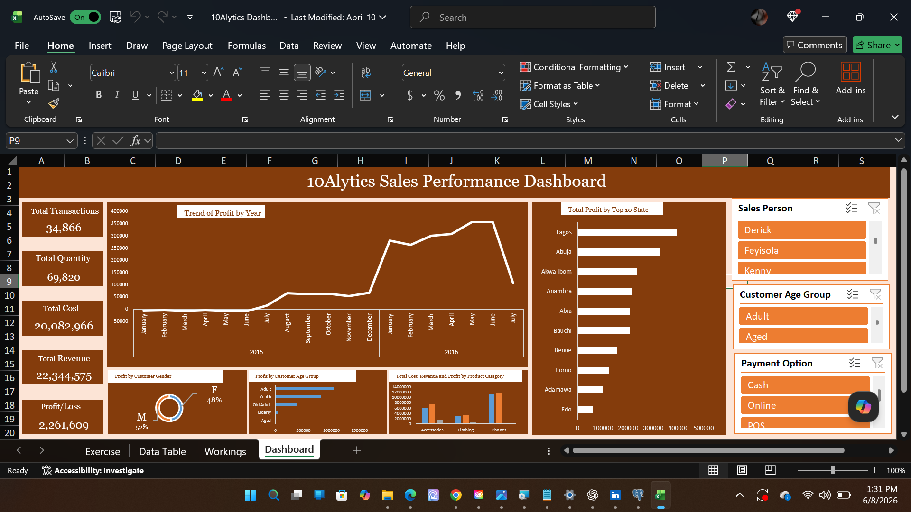

# 10Alytics Sales Performance Dashboard

## Dashboard Preview

---

## Project Overview

This project analyzes sales performance using Microsoft Excel to identify revenue trends, profitability drivers, customer demographics, product category performance, and regional sales patterns.

The dashboard was developed using Pivot Tables, Pivot Charts, KPI Cards, Interactive Slicers, and Dashboard Design techniques to provide actionable business insights.

---

## Tools Used

- Microsoft Excel

---

## Business Questions

1. What is the overall revenue, cost, and profit generated?
2. How has profit changed over time?
3. Which states generate the highest profits?
4. Which product categories contribute most to revenue and profit?
5. What customer age groups generate the most profit?
6. What is the gender distribution of profit contribution?

---

## Key Metrics

- Total Transactions: 34,866
- Total Quantity Sold: 69,820
- Total Cost: 20,082,966
- Total Revenue: 22,344,575
- Profit/Loss: 2,261,609

---

## Key Findings

- The business generated over 22.3 million in revenue and more than 2.2 million in profit.
- Profit increased significantly during 2016 compared to 2015.
- Lagos generated the highest profit among all states.
- Male customers contributed slightly more profit than female customers.
- Adult customers represented the most profitable age group.
- Phones generated the highest revenue and profit among product categories.

---

## Files Included

- Excel Dashboard Workbook
- Dashboard Screenshot
- Project Documentation

---

## Conclusion

The dashboard provides a comprehensive view of sales performance by combining financial, customer, product, and geographic insights into a single interactive report. These findings can support better decision-making, improve profitability, and guide future sales strategies.
