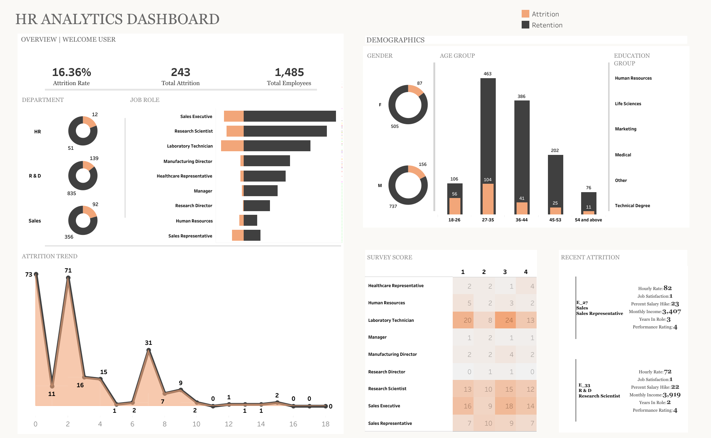

# HR Analytics Dashboard

## Overview

This Tableau dashboard provides an interactive analysis of employee attrition, retention, workforce demographics, job roles, and employee satisfaction metrics. The dashboard helps HR teams identify workforce trends, understand attrition patterns, and support data-driven talent management decisions.

## Tools Used

* Tableau

## Project Objectives

* Analyze employee attrition and retention rates.
* Identify departments and job roles with high attrition.
* Examine workforce demographics.
* Evaluate employee satisfaction survey results.
* Monitor employee turnover trends.
* Support workforce planning and retention strategies.

## Key Features

* Attrition Rate KPI
* Employee Demographics Analysis
* Department-Level Attrition Analysis
* Job Role Analysis
* Employee Survey Heatmap
* Attrition Trend Monitoring
* Recent Attrition Tracking
* Interactive Dashboard Navigation

## Skills Demonstrated

* HR Analytics
* Workforce Analytics
* Data Visualization
* Dashboard Development
* KPI Reporting
* Trend Analysis
* Data Storytelling

## Dashboard Insights

* The organization recorded an attrition rate of 16.36%.
* Research & Development experienced the highest employee turnover volume.
* Employees aged 27–35 represented the largest workforce segment.
* Attrition was observed across multiple job roles, with Sales Executives showing notable turnover.
* Survey results provide additional insight into employee satisfaction patterns.

## Dashboard Preview

