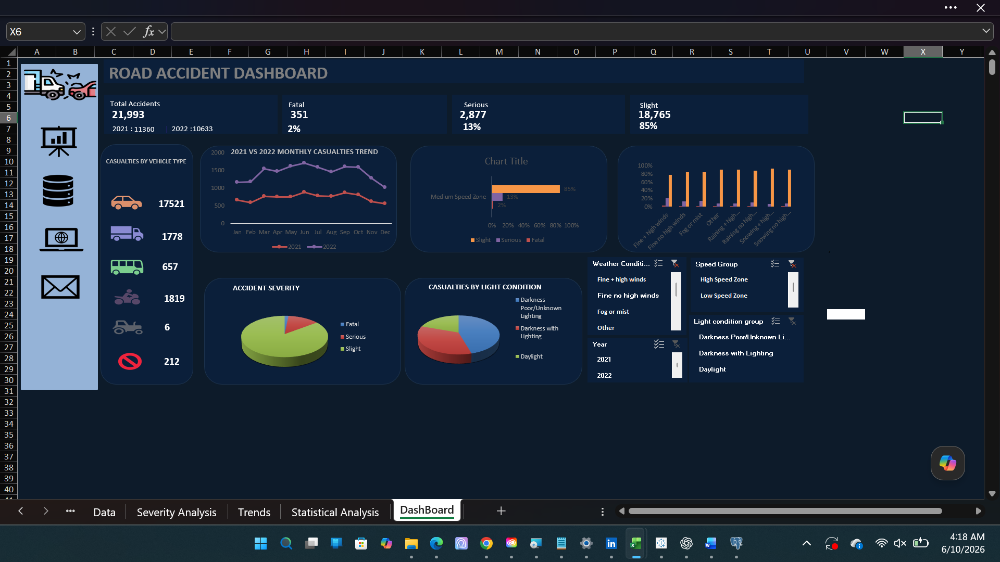

# Road Accident Analysis Dashboard

## Dashboard Preview

---

## Project Overview

This project analyzes road accident data to identify key factors contributing to accident frequency and severity. The dashboard was developed using Microsoft Excel and interactive visualizations to support data-driven road safety decisions.

---

## Objectives

- Analyze accident frequency and severity.
- Identify key risk factors influencing accidents.
- Provide insights and recommendations for safety improvements.

---

## Tools Used

- Microsoft Excel

## Skills Demonstrated

- Data Cleaning and Preparation
- Data Analysis
- Dashboard Design
- Data Visualization
- Pivot Table Analysis
- Pivot Chart Development
- Interactive Slicer Implementation
- KPI Reporting
- Business Intelligence Reporting

---

## Data Preparation

- Cleaned missing and inconsistent data.
- Standardized variables.
- Created Time Bands and Speed Groups.
- Built Pivot Tables and Dashboard Visualizations.

---

## Key Metrics

- Total Accidents: 21,993
- Fatal Casualties: 351 (2%)
- Serious Casualties: 2,877 (13%)
- Slight Casualties: 18,765 (85%)

---

## Analysis Performed

### 1. Monthly Accident Trend
- Accident frequency peaked around October and November.
- A noticeable decline was observed in December.

### 2. Severity by Speed Limit Category
- Low and Medium Speed Zones recorded the highest proportion of slight accidents.
- High Speed Zones showed a higher share of serious accidents.

### 3. Casualties by Light Conditions
- Daylight conditions accounted for the largest number of slight accidents.
- Poor or unknown lighting conditions showed higher proportions of serious and fatal accidents.

### 4. Vehicle Type Analysis
- Cars recorded the highest number of casualties.
- Vans, buses, motorcycles, agricultural vehicles, and other vehicle categories were also analyzed.

---

## Key Findings

- Accident frequency increases during certain months, particularly October and November.
- High-speed zones contribute significantly to serious accident outcomes.
- Lighting conditions influence accident severity.
- Most recorded casualties were classified as slight injuries.

---

## Recommendations

### 1. Reduce Serious and Fatal Accidents
Track fatal and serious accident rates separately from total accident counts.

### 2. Focus on High-Risk Roads
Implement speed management measures, enforcement, signage improvements, and road design reviews.

### 3. Use Interactive Filters
Leverage dashboard slicers to investigate accident patterns by year, weather condition, speed category, and lighting condition.

### 4. Maintain Regular Updates
Refresh dashboard datasets, pivot tables, and charts whenever new accident records become available.

---

## Files Included

- Excel Dashboard Workbook
- Dashboard Screenshot
- PowerPoint Presentation

---

## Conclusion

The Road Accident Dashboard highlights important relationships between accident severity, speed limits, lighting conditions, and accident frequency. These insights can support transportation authorities and policymakers in developing targeted interventions to improve road safety and reduce severe accidents.
