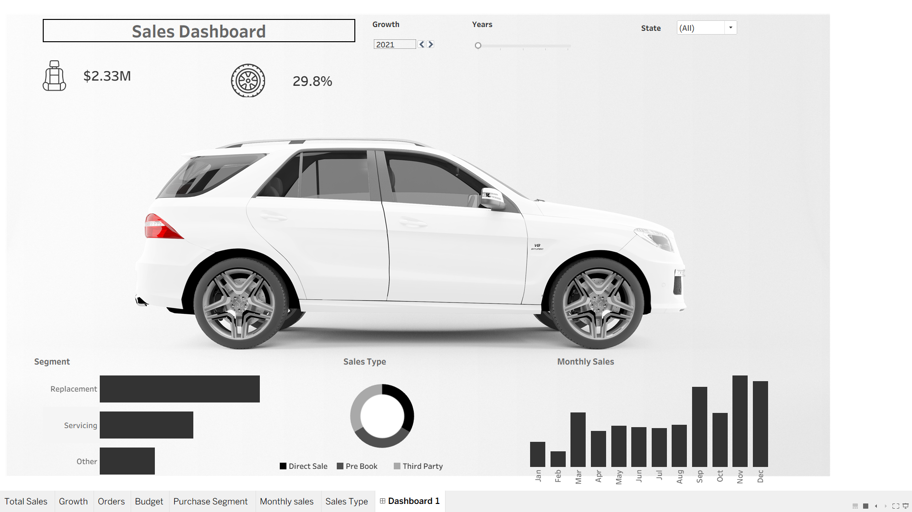

# SuperCar Motors Sales Dashboard

## Overview

This project presents an interactive Tableau dashboard designed to analyze sales performance, growth trends, customer segments, and sales types for SuperCar Motors.

## Tools Used

- Tableau
- Data Visualization
- Dashboard Design
- Business Intelligence

## Key Features

- Sales performance tracking
- Growth analysis
- Monthly sales trends
- Customer segment analysis
- Interactive filters

## Skills Demonstrated

- Data Analysis
- Dashboard Development
- KPI Reporting
- Business Intelligence
- Data Storytelling

## Dashboard Preview

